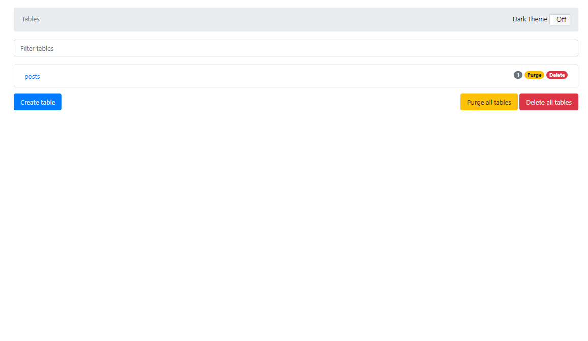

🌙 lambda-chatgpt-api
====


## 📗 プロジェクトの概要

POSTで問い合わせをすると、ChatGPTが返答してくれるAPIです。
Lambdaで動作させることが出来ます。

## 🌐 Demo


## 📦 ディレクトリ構造

```
.
├── README.md
├── app
│   ├── coverage
│   ├── dist
│   ├── jest.config.ts
│   ├── node_modules
│   ├── package-lock.json
│   ├── package.json
│   ├── src
│   ├── tests
│   └── tsconfig.json
├── dc.sh
├── demo.png
├── docker
│   ├── awscli
│   ├── docker-compose.yml
│   └── dynamodb
├── layers
│   └── app-layer
├── samconfig.toml
├── schema
│   └── posts.json
├── task
│   ├── env.json
│   └── env.json.example
└── template.yaml

```

## 🔧 開発環境の構築

IAM ユーザーを用意する
```
ユーザ名：「lambda-user」
アクセス権限：
「AdministratorAccess」
```

SAM CLI をインストールする
```
$ pip install aws-sam-cli
```

AWSにアクセスする為の設定を作成する
```
$ aws configure --profile lambda-user 
AWS Access Key ID [None]: xxxxxxxxxx
AWS Secret Access Key [None]: xxxxxxxxxx
Default region name [None]: ap-northeast-1
Default output format [None]: json
```

## 🖊️ Docker 操作用シェルスクリプトの使い方

```
Usage:
  dc.sh [command] [<options>]

Options:
  stats|st                 Dockerコンテナの状態を表示します。
  init                     Dockerコンテナ・イメージ・生成ファイルの状態を初期化します。
  start                    すべてのDaemonを起動します。
  stop                     すべてのDaemonを停止します。
  --version, -v     バージョンを表示します。
  --help, -h        ヘルプを表示します。
```


## 💬 使い方

ローカルでAPIを起動する
```
# 事前準備
$ ./dc.sh init
$ docker network create lambda-local

# Dockerを起動する
$ ./dc.sh start

# DynamoDBにテーブルを作成する
$ ./dc.sh aws local
> aws dynamodb create-table --cli-input-json file://schema/posts.json --endpoint-url http://dynamodb:8000  --billing-mode PAY_PER_REQUEST
> aws dynamodb list-tables  --endpoint-url http://dynamodb:8000 
(テーブルを削除する場合)
> aws dynamodb delete-table --table-name lambda_chatgpt_api_posts --endpoint-url http://dynamodb:8000

# ESModuleでビルドできるようにする
$ npm install -g esbuild 
# SAMでアプリをビルドしてからAPIを起動する
$ sam build
$ sam local start-api --env-vars task/env.json --docker-network lambda-local

# シンプルな投稿
$ curl http://127.0.0.1:3000/post -X POST -H 'Content-Type: application/json' -d '{ "message": "こんにちわ！" }'
$ curl http://127.0.0.1:3000/post -X POST -H 'Content-Type: application/json' -d '{ "message": "こんにちわ！", "system": "英語で返信してください" }'

# Roleを指定した投稿
$ curl http://127.0.0.1:3000/post -X POST -H 'Content-Type: application/json' -d '{ "message": [
        {"role": "user", "content": "1たす1は？"},
        {"role": "assistant", "content": "2です。"}, 
        {"role": "user", "content": "それを3倍して。"} 
    ], "system": "あなたは賢いAIです"}'
    
# セッションを利用した投稿 （contextTimeで5分間に指定しています）
$ curl http://127.0.0.1:3000/post -X POST -H 'Content-Type: application/json' -d '{ "appId": "app1", "contextTime": 500000, "userKey": "test@test.com", "message": "1たす1は？" }'
$ curl http://127.0.0.1:3000/post -X POST -H 'Content-Type: application/json' -d '{ "appId": "app1", "contextTime": 500000, "userKey": "test@test.com", "message": "それを3倍して。" }'

```

本番環境（AWS） にデプロイする
```
# ビルドを実行する（.aws-samディレクトリに生成される）
$ sam build
# AWSに反映する
$ sam deploy --config-env stg

# AWSから、DynamoDB、Lambda&APIGatewayを削除する
$ sam delete --stack-name lambda-chatgpt-api --profile lambda-user
```

### DynamoDBAdmin
DynamoDBに接続してデータの参照や編集が可能です。
Dockerを起動後に以下のURLにアクセスすると利用可能です。

http://localhost:8001/




## 🎨 参考

| プロジェクト| 概要|
| :---------------------------------------| :-------------------------------|
| [ChatGPT (OpenAI) を AWS Lambda / Slack 上で動かす](https://blog.nekohack.me/posts/chatgpt-slack)| ChatGPT (OpenAI) を AWS Lambda / Slack 上で動かす |


## 🎫 Licence

[MIT](https://github.com/isystk/lambda-chatgpt-api/blob/master/LICENSE)

## 👀 Author

[isystk](https://github.com/isystk)
