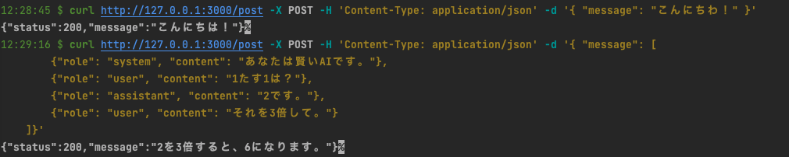

🌙 openai-gpt-api
====


## 📗 プロジェクトの概要

POSTで問い合わせをすると、ChatGPTが返答してくれるAPIです。
Lambdaで動作させることが出来ます。

## 🌐 Demo



## 📦 ディレクトリ構造

```
.
├── README.md
├── app (Lambdaのモジュール)
│   ├── app.js
│   ├── lambda.js
│   ├── local-app.js
│   ├── node_modules
│   ├── package-lock.json
│   ├── package.json
│   └── tests
├── layers (共通モジュール)
│   └── app-layer
├── samconfig.toml
└── template.yaml
```

## 🔧 開発環境の構築

IAM ユーザーを用意する
```
ユーザ名：「lambda-user」
アクセス権限：
「AdministratorAccess」
```

SAM CLI をインストールする
```
$ pip install aws-sam-cli
```

AWSにアクセスする為の設定を作成する
```
$ aws configure --profile lambda-user 
AWS Access Key ID [None]: xxxxxxxxxx
AWS Secret Access Key [None]: xxxxxxxxxx
Default region name [None]: ap-northeast-1
Default output format [None]: json
```

## 💬 使い方

ローカルでAPIを起動する
```
# SAMでアプリをビルドしてからAPIを起動する
$ sam build
$ sam local start-api --env-vars task/env.json

# 投稿
$ curl http://127.0.0.1:3000/post -X POST -H 'Content-Type: application/json' -d '[
        {"role": "system", "content": "あなたは賢いAIです。"},
        {"role": "user", "content": "1たす1は？"},
        {"role": "assistant", "content": "2です。"}, 
        {"role": "user", "content": "それを3倍して。"} 
    ]'
```

本番環境（AWS） にデプロイする
```
# ビルドを実行する（.aws-samディレクトリに生成される）
$ sam build
# AWSに反映する
$ sam deploy --config-env stg

# AWSから、DynamoDB、Lambda&APIGatewayを削除する
$ sam delete --stack-name openai-gpt-api --profile lambda-user
```

## 🎨 参考

| プロジェクト| 概要|
| :---------------------------------------| :-------------------------------|
| [ChatGPT (OpenAI) を AWS Lambda / Slack 上で動かす](https://blog.nekohack.me/posts/chatgpt-slack)| ChatGPT (OpenAI) を AWS Lambda / Slack 上で動かす |


## 🎫 Licence

[MIT](https://github.com/isystk/openai-gpt-api/blob/master/LICENSE)

## 👀 Author

[isystk](https://github.com/isystk)
